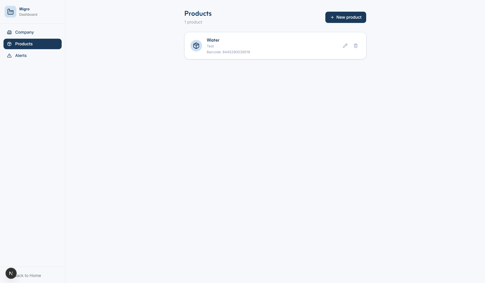
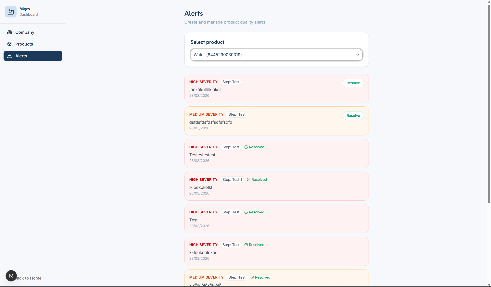
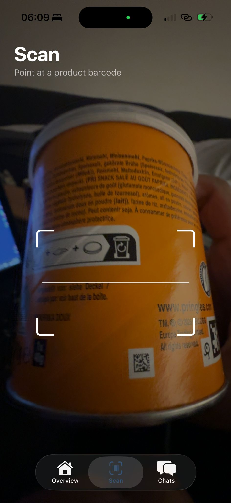
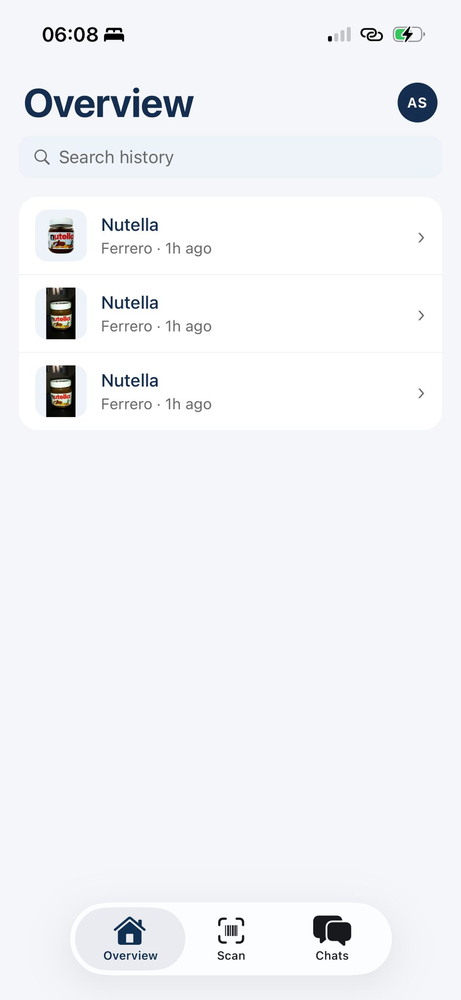
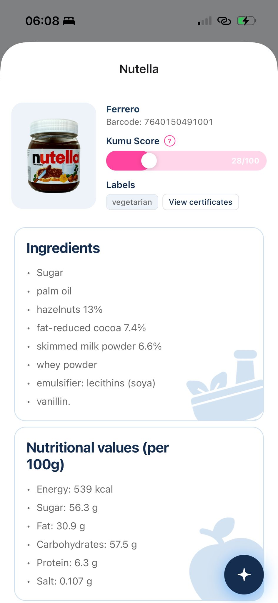
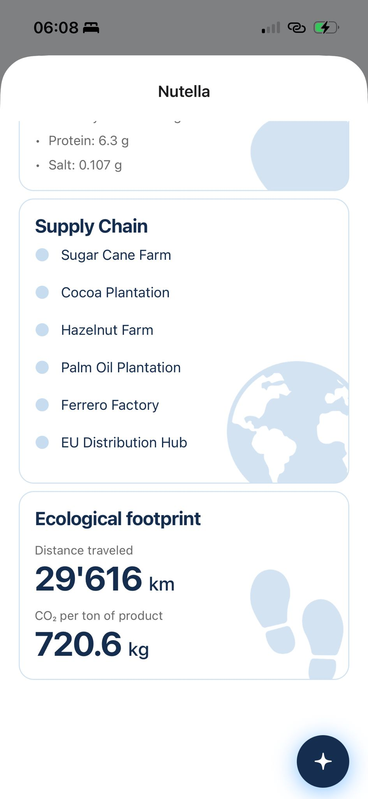
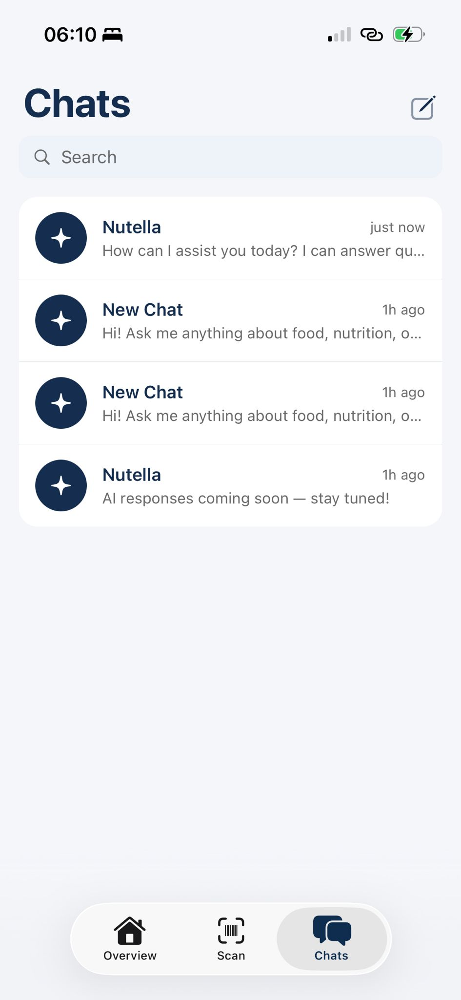
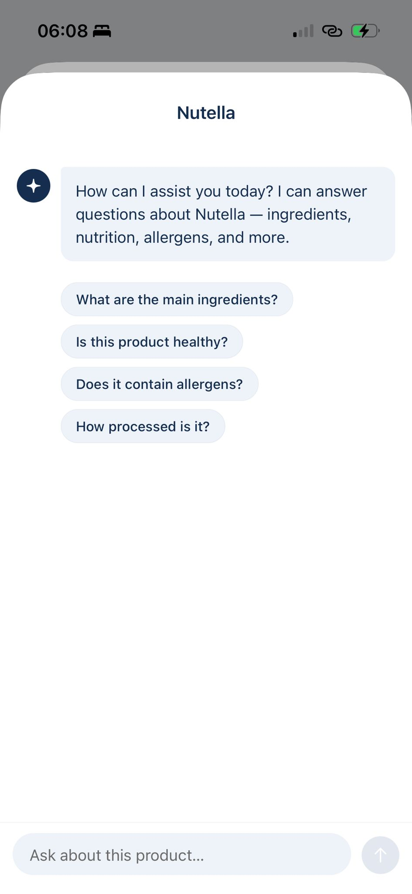

# Kumu

## Kumu in einem Satz

Kumu ist eine Lebensmittel-Transparenzplattform mit Barcode-Scan, Produktinfos,
Lieferkettenkontext und einem Supplier-Portal fuer Produkt- und Alert-Pflege.

## Kurzueberblick

Kumu besteht aktuell aus drei Kernteilen:

- Web-App fuer Supplier-Workflows und die veroeffentlichte Demo
- Mobile App fuer Scan, Produktansicht, Verlauf und Chat
- Convex-Backend fuer Auth, Datenmodell, Alerts, Notifications und Chats

Der aktuelle Produktstand ist ein lauffaehiger Demo- und MVP-Stand mit echter
Web-App, echter Mobile-App und echtem Backend. Fuer Tests und Demos sind die
Barcode-Ergebnisse jedoch absichtlich gemockt und liefern nur Testresultate.

## Live-Demo

Web-Demo: [https://kumu-web.vercel.app/](https://kumu-web.vercel.app/)

Hinweis: Die veroeffentlichte Seite startet aktuell mit einem Sign-in-Screen.

## Wichtiger Demo-Hinweis

> Alle Barcode-Ergebnisse in der Demo sind gemockt.
> Es werden nur Testresultate angezeigt. Die Demo ist fuer die Darstellung des
> Produktflusses gedacht und nicht fuer echte Produktverifikation.

## Produktvideo

<video src="media/kumu-web-search.mp4" controls width="100%">
  Ihr Browser unterstuetzt das Video-Tag nicht.
  <a href="media/kumu-web-search.mp4">Video herunterladen (MP4)</a>
</video>

[Video direkt oeffnen (MP4)](media/kumu-web-search.mp4)

## Screenshots Web

**Produktliste**

**Alerts**

## Screenshots Mobile

| Scan                                | Verlauf                                    | Produktdetail                                          |
| ----------------------------------- | ------------------------------------------ | ------------------------------------------------------ |
|  |  |  |

| Produktdetail 2                                            | Chats                                 | Chat                                |
| ---------------------------------------------------------- | ------------------------------------- | ----------------------------------- |
|  |  |  |

## Dokumentation

| Datei                                                      | Inhalt                                                               |
| ---------------------------------------------------------- | -------------------------------------------------------------------- |
| [Produktueberblick](docs/produktueberblick.md)             | Problem, Zielgruppen, Nutzen und aktueller Produktumfang             |
| [Anwenderguide](docs/anwenderguide.md)                     | OTP-Login, Scan-Flow, Produktansicht, Verlauf, Chat und Profil       |
| [Lieferantenguide](docs/lieferantenguide.md)               | Firmenprofil, Produktpflege, Supply-Chain-Daten und Alerts           |
| [Technik und Betrieb](docs/technik-und-betrieb.md)         | Monorepo, Frontends, Backend, CI und Deployment                      |
| [Testing und Demo](docs/testing-und-demo.md)               | Testansatz, Live-Demo und Demo-Grenzen                               |
| [Bewertungsargumentation](docs/bewertungsargumentation.md) | Begruendung fuer Reifegrad, Architektur, UX, Doku und Code-Qualitaet |
